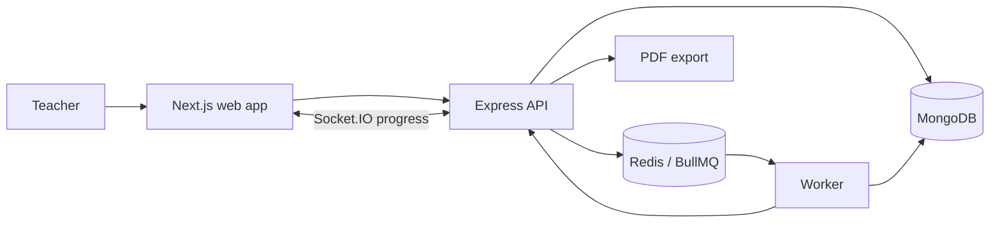

# VEDAai Assessment Studio

AI Assessment Studio is a teacher-facing workflow for creating assignments, generating structured question papers, reviewing/editing the output, regenerating parts of the paper, and exporting a clean exam PDF. It is built as a practical monorepo rather than a single prompt box: generation happens as a background-capable workflow, progress is streamed over WebSockets, and AI output is treated as structured JSON validated by Zod before it is rendered.

## Tech Stack

- Frontend: Next.js, TypeScript, Tailwind CSS, Zustand, Socket.IO client
- Backend: Express, TypeScript, Mongoose, Socket.IO
- Worker: BullMQ with Redis
- Database: MongoDB
- Queue: Redis + BullMQ
- Validation: Zod shared package
- PDF: Puppeteer
- AI mode: optional provider integration point, deterministic mock fallback for demo mode

## Architecture



## Monorepo

```text
apps/
  web/      Next.js teacher studio
  api/      Express REST API + Socket.IO + PDF export
  worker/   BullMQ generation worker
packages/
  shared/   Zod schemas, types, prompt preview, deterministic generator
```

## Setup

```bash
npm install
docker compose up -d
npm run seed
npm run dev:api
npm run dev:worker
npm run dev:web
```

Open `http://localhost:3000`. The API runs on `http://localhost:4000`.

For a no-Redis demo, run only `npm run dev:api` and `npm run dev:web`. The API falls back to inline mock generation unless `USE_QUEUE=true` or `REDIS_URL` is set.

## Environment Variables

```bash
# apps/api and apps/worker
MONGO_URL=mongodb://localhost:27017/vedaai_assessment_studio
REDIS_URL=redis://localhost:6379
WEB_ORIGIN=http://localhost:3000
API_URL=http://localhost:4000
PORT=4000
USE_QUEUE=true

# apps/web
NEXT_PUBLIC_API_URL=http://localhost:4000

# Optional future AI integration
OPENAI_API_KEY=
ANTHROPIC_API_KEY=
GEMINI_API_KEY=
```

## API Routes

- `POST /api/assignments`
- `GET /api/assignments`
- `GET /api/assignments/:id`
- `POST /api/assignments/:id/generate`
- `POST /api/assignments/:id/regenerate`
- `PATCH /api/assignments/:id/questions/:questionId`
- `DELETE /api/assignments/:id/questions/:questionId`
- `GET /api/assignments/:id/export.pdf`
- `GET /api/health`

## WebSocket Events

The web app joins a room with:

```text
assignment:join -> assignmentId
```

Progress events:

- `generation:queued`
- `generation:started`
- `generation:progress`
- `generation:validating`
- `generation:completed`
- `generation:failed`

Payload:

```json
{
  "assignmentId": "abc123",
  "step": "validating",
  "message": "Checking marks and difficulty balance",
  "progress": 75
}
```

## AI Schema Design

The app never renders raw AI text. AI output must match:

```json
{
  "sections": [
    {
      "title": "Section A",
      "instruction": "Attempt all questions",
      "questions": [
        {
          "text": "...",
          "type": "short-answer",
          "marks": 2,
          "difficulty": "easy",
          "topic": "Algebra",
          "bloomLevel": "Understand"
        }
      ]
    }
  ]
}
```

`packages/shared` validates the paper with Zod. The intended production path is: parse provider JSON, repair malformed JSON if needed, retry once, then fall back to deterministic sample generation so teachers always get a usable paper.

## Queue Flow

1. API creates assignment in MongoDB.
2. API enqueues `generate-paper` or `regenerate-section` in BullMQ.
3. Worker loads assignment, emits progress, generates schema-safe paper, validates, saves result.
4. Web app receives live Socket.IO updates and also polls the assignment detail as a resilience fallback.

## Deployment Plan

- Frontend: Vercel
- Backend + Worker: Render or Railway
- MongoDB: MongoDB Atlas
- Redis: Upstash or Redis Cloud

## Screenshots

Add screenshots after deployment:

- Dashboard
- Create assignment
- Generation timeline
- Editable generated paper
- Exported PDF

## Tradeoffs and Future Improvements

- The project includes deterministic demo generation so it works without a paid AI key.
- PDF export uses Puppeteer in the API; for serverless deployments this may need a hosted browser or React PDF.
- Worker progress is bridged through the API Socket.IO server; a production system could use Redis pub/sub for multi-instance fanout.
- PDF source ingestion is represented as pasted/extracted text; production upload parsing can be added with a file storage layer.
- Authentication and school/teacher tenancy are intentionally left as next steps.

## Submission Note

I built this as a real teacher-facing assessment workflow rather than a simple AI form. The system uses a monorepo architecture with Next.js, Express, MongoDB, Redis, BullMQ, and WebSockets. Generation runs as a background job with live progress updates, and the AI output is parsed into a strict structured schema before rendering. Teachers can review/edit the generated paper, regenerate sections, and export a clean exam-style layout.
